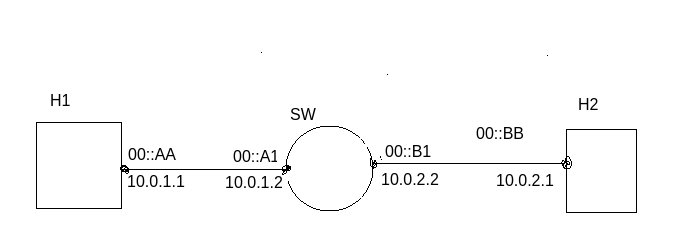

# Printer -  Simple IP router 
<h1 align="center">PRINtler</h1>

<p align="center">
  
  <br>
  <i>PRINtler a simple IP router for PRIN course on WUT</i>
  <br>
</p>

## 1 Business reqs
### 1.1 IP Router
#### 1.1.1 Opis
**Routing**
User wpisuje do tabeli wpis:
- docelowy adres IP (adres hosta) (to jest kluczem przeszukiwania tabeli)
- na jaki port kierowac ten pakiet (czyli za pomoca, ktorego portu mamy osiagnac dany host docelowy) (to jest parametr akcji)
- adres MAC next-hopa, ktory ma zostac wpisany w pakiet w warstwie ETH (zeby next-hop go nie odrzucil na L2)

**TTL**

Dodatkowo pakiet IP ma mieć odczytywane pole TTL i odrzucane jesli jest ono mniejsze niz 2. 

**Checksum**

Dodatkowo aktualizowac ma sie suma kontrolna.
#### 1.1.2
- [ ] Routing
- [ ] TTL
- [ ] checksum
#### 1.1.3 Co to implikuje
Sieć złożona z dwóch hostów oraz switcha. Wszystkie urządzenia mają mieć przypisane statyczne adresy IP oraz MAC. Trzeba to zdefiniować w [1sw_demo.py](1sw_demo.py).

**checksum**
Na poprzednich zajeciach nie musielismy tego robic bo nic nie zmienialismy w protokole IP. Hosty bedą odrzucać pakiety ze zła sumą kontrolną, więc od tego nalezy zacząć implementację.
#### 1.1.4 Testy
**Routing**

Mozna wymyslec topologie oraz jakie wpisy dodac do tabeli zeby przetestowac ruting.
**TTL**

Po odpaleniu Mininet mozesz wejsc w jego iptables i dodac zeby wszystkie pakiety IP wysylal z TTL 1.
```sh
Mininet CLI> h1 iptables -t mangle -A POSTROUTING -j TTL --ttl-set 2
```
**checksum**

Jesli bedzie bledna to host odrzuci. 

### 1.2 IP Filter
#### 1.2.1 Opis
Use wpisuje do tabeli wpis, który reprezentuje trójkę, która identyfikuje pakiet jaki należy odrzucać. Ta trójka to:
- docelowy adres IP
- protokół warstwy transportowej
- port

np. `{10.0.0.1, TCP. 80}`

ale moze też być wildcard czyli np. `{10.0.0.1, TCP, *}` to tego będzie Ci potrzebny ten ternary operator.
#### 1.2.2 Reqs
- [ ] Basic filter
- [ ] Wildcards
#### 1.2.3 Co to implikuje 
Nic.
#### 1.2.4 Testy
Przez mininet mozna wejsc na hosty przez xterm do ich shell'a i uzyc scapy. Na jednym uruchamia sie klient a na drugim serwer i mozna testowac connections TCP lub UDP.

> Note: scapy bedzie trzeba za kazdym razem instalowac podczas runtime. Albo mozesz zmodyfikowac skrypt [1sw_demo.py](1sw_demo.py)

Alternatywą dla scapy jest [nc](https://linux.die.net/man/1/nc).
**Basic filter**

Można wymyślec wpisy do tabeli i potem scapy'm generować ruch.
**Wildcards**

Po stronie Trift będzie to samo. Inne tylko testy na scapy.
### 1.3 Stats
#### 1.3.1 Opis
Router ma zbierac statystyki dotyczące ...(lista poniżej). User za pomocą Trift moze sobie je querować. Nie wiem jeszcze jakie komendy trift to robią.

**Jakie staty:**

- Dla każdego portu liczba pakietów
	- odebranych
	- przeslanych dalej
	- wyslnaych
- Dla całego switcha
	- liczba pakietów odrzuconych

Każdy port na warstwie fizycznej najniższej ma Receiver oraz Transceiver. Więc jak mówimy o porcie, to on w danej sytuacji (procesowania single pakietu) pełni rolę albo Tx albo Rx.
Pojęcia odebrać/wysłać pakiet są w odeniesiu do swtich - external world. Więc odebrać może tylko Rx. Wysłać tylko Tx. Pojęcie przesłać dalej jest w obrębie switcha, więc może to zrobić jedynie Rx.


### 1.3.2 Topologia


Tak nalezy zmodyfikować plik [1sw_demo.py](1sw_demo.py).

Na tym rysunku dodaj maske podsieci /24 do adresów IP bo to sugeruje maske 32 jak nie ma jej.


## 2 Przebieg cwiczenia
### 2.1 Przygotowanie topologii
Najpierw nalezy przygotowac topologię według rysunku z sekcji 1.3.2. Polega to na modyfikacji pliku 1sw_demo.py. 

```sh
sudo python3 1sw_demo.py --behavioral-exe=/usr/bin/simple_switch --json template.json
```

Następnie za pomocą Mininet CLI przetestowano czy zaszły w topologii odpowiednie zmiany. Ale okazuje się, że [1sw_demo.py](1sw_demo.py) wcale nie ustala konfiguracji IP i MAC na s1. Tzn. nie ma tych informacji w mininet po uzyciu komendy `s1 ifconfig -a`. W lab 3 zresztą też nie ma. adres IP do interfejsu jest przypisywany dynamicznie więc najwyżej podczas runtime będzie on odczytywany. Adres IP najprawdopodobniej nie będzie potrzebny podczas realizacji ćwiczenia, dlatego postanowiono pozostawić topologię nieco różniącą się od tej z rysunku w sekcji 1.3.2.

Zakres funkcjonalny programu podzieliłem na 3 części/moduły:
- IP Router
- IP Filter
- Stats 
Ich opis znajduje się w sekcji 1.


