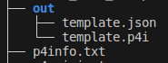

# Lab 5 - P4 Runtime
## 1. Wstęp
Podczas tego laboratorium wykorzystamy po raz pierwszy P4 Runtime. Jest to protokół do komunikacji między data plane a control plane. Protokół jest w architekturze klient/serwer.

Serwer znajduje się na switchu, a klientem jest sterownik SDN.

Po pierwsze będziemy musieli użyć switcha, króry takowy serwer posiada.

```sh
sudo python3 1sw_demo.py --behavioral-exe /usr/bin/simple_switch_grpc --json out/main.json
```
Czyli korzystamy z innej binarki niż dotychczas, uruchamia ona serwer P4 na porcie 9559.

Jak teraz do tego serwera się połączyć?

Potrzebujemy jakiegoś klienta, zainstalujemy go tym poleceniem.
```sh
pip3 install --upgrade \
git+https://github.com/p4lang/p4runtime-shell.git#egg=p4runtime-shell
```

a uruchamiać będziemy tym:
```sh
sudo python3 -m p4runtime_sh --grpc-addr localhost:9559 --device-id 0 --election-id 0,1 --config p4info.txt,out/main.json
```

Ok, ale co to za opcja `config`?
Otóż w switch `simple_switch_grpc` jest nieco inny. Jemu nie podaje się programu P4 podczas uruchamiania binarki. On uruchamia się pusty (mimo, że jest tam podawany argument `--json` -> ale to zaszlość historyczno-skryptowa). Jemu program można wgrać z warstwy sterowania i właśnie do tego służy opcja `--config`. Gdy jej użyjesz to wgrasz nowy program. 

No dobra, ale co to za pliki `p4info.txt` i `out/main.json`. Wcześniej samemu nazywalo się plik p4. Skąd je wziąć?

Otóż kompilacja programu p4 przez p4-compiler wygląda teraz tak:

```sh
p4c --target bmv2 --arch v1model --p4runtime-files p4info.txt -o out/ plik.p4
```

## 2. Wykonane czynności
### 2.1 Czynności wstępne
Instalacja p4runtime-shell. Tu odkryto błąd w komendzie z lab.
```sh
pip3 install --upgrade \
git+https://github.com/p4lang/p4runtime-shell.git#egg=p4runtime-shell
```
Modyfikacja pliku p4_mininet.py
```python
- args.append(self.json_path)
+ args.append("--no-p4")
```

Kompilacja programu P4, użyto programu template z pierwszego warsztatu.
```sh
p4c --target bmv2 --arch v1model --p4runtime-files p4info.txt -o out/ template.p4
```
Poskutkował to powstaniem takich pilków:



Uruchomienie sieci:
```sh
sudo python3 1sw_demo.py --behavioral-exe /usr/bin/simple_switch_grpc --json out/template.json
```

Uruchomienie sterownika:
```sh
python3 -m p4runtime_sh --grpc-addr localhost:9559 --device-id 0 --election-id 0,1 --config p4info.txt,out/template.json
```